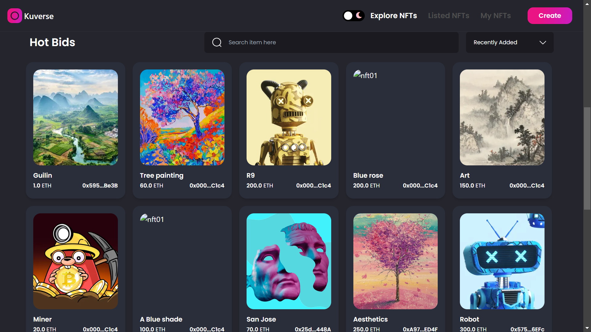

# Kuverse 

Kuverse is an NFT marketplace where users can mint their pictures as NFTs, list their NFTs for sale, and buy NFTs from other users.

# 🛠 Technology Stack & Tools

- Solidity (Writing Smart Contract)
- Javascript (NextJs & Testing)
- Ether (Blockchain Interaction)
- hardhat (Development Framework)
- IPFS (File hosting)

# ⛓ Blockchain Protocol used

- ERC-721 standard

# ⚙ Requirements For Initial Setup
- Install NodeJS, should work with any node version below 16.5.0
- Install Hardhat, In your terminal, you can check to see if you have Hardhat by running Hardhat version. To install Hardhat `npm i hardhat`. Ideal to have hardhat version 5.4 to avoid dependency issues.

# 🚀 Quick Start

📄 Clone or fork Kuverse-NFT-Marketplace:

```
https://github.com/paschal533/Kuverse-NFT-Marketplace.git
```
💿 Install all dependencies:
 
```
$ cd Kuverse-NFT-Marketplace
$ npm install -f
```

# 🔐 Add the required environment variables.

You can find all the required environment variables for the frontend in the `.env.local.Example` file

```
//NEXT_PUBLIC_INFURA_IPFS_PROJECT_SECRET = // Infura IPFS Project secret
NEXT_PUBLIC_INFURA_IPFS_PROJECT_ID =  // Infura IPFS Project ID

```

After adding the environment variables, Rename the file from `.env.local.Example` to `.env.local`

# 🚴‍♂️ Run your App:

```
npm run dev
```

# 🛠 test the smart-contract:

```
npx hardhat test
```

- Note :- This app was deploy to Base Sepolia testnet, so you need to connect your wallet to Base Sepolia before you can Interact with the app.

Base Sepolia Explorer

```
https://sepolia.basescan.org/address/0x1D893fcd6Cd87A3348942cD3DC5Cf1A945C60068
```

# 🎗 Overview

- Home page


- Listed NFTs page



- My NFTs page


- NFT details and purchase NFT page


- Create and Mint NFT page


- Light Mode


